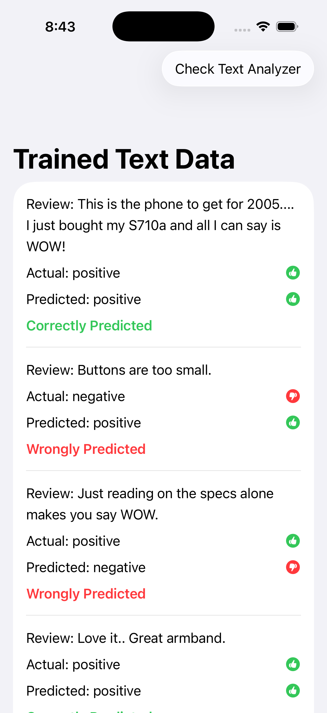
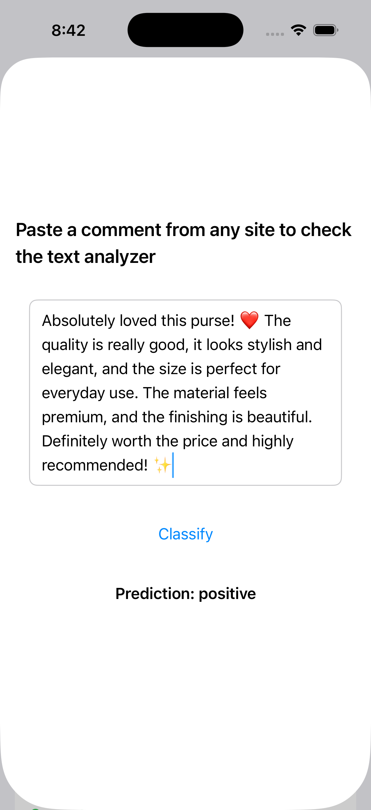
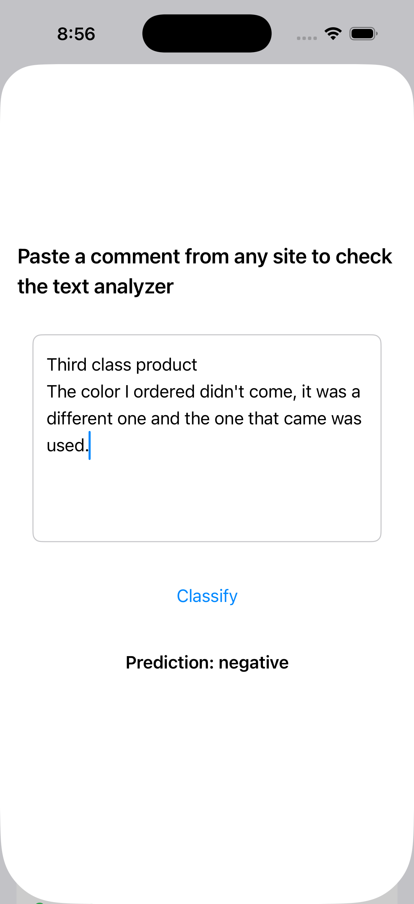

# 📝 Text Sentiment Analyzer — SwiftUI + Core ML

An iOS demo app built with **SwiftUI** and powered by a **Core ML model** trained in **Create ML**. The app showcases sentiment analysis by classifying text comments as **positive** or **negative**. It includes a list view displaying trained dataset results (actual vs predicted labels) and an interactive analyzer view where users can paste any comment to check its tonality. Designed as a learning project to explore machine learning integration in iOS apps with a clean, modern UI.

## ✨ Features

- **SwiftUI based UI** for modern, declarative interface design
- **Core ML integration** for text sentiment classification
- **Create ML trained model** for positive/negative tonality detection
- **Interactive demo**:
  - A list view showing trained dataset with actual vs predicted labels
  - A detail view where users can paste any comment and classify its sentiment

## 📱 Requirements

- iOS 17+
- Xcode 15+
- Swift + SwiftUI
- Core ML framework
- Create ML for training the model

## 🛠 Technologies

- Swift
- SwiftUI
- Core ML
- Create ML

## 📂 Dataset / Inputs

- Training and test datasets prepared in JSON format
- Model trained in **Create ML app** with labeled text data (positive/negative)

## 📷 Screenshots

<table>
  <tr>
    <td align="center">
       
      Trained Data List (Actual vs Predicted)
    </td>
    <td align="center">
       
      Text Analyzer Result (Positive)
    </td>
    <td align="center">
       
      Text Analyzer Result (Negative)
    </td>
  </tr>
</table>
